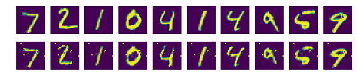

```python
#비지도학습 Autoencoder
#텐서플로, numpy, matplotlib의 라이브러리 임포트
import tensorflow as tf
import numpy as np
import matplotlib.pyplot as plt

#MNIST 모듈 임포트
from tensorflow.examples.tutorials.mnist import input_data
mnist = input_data.read_data_sets("MNIST_data/", one_hot=True)

#########
#옵셥설정#
#########

learning_rate = 0.01 #최적화 함수에서 사용할 학습률
training_epoch = 20  #전체 데이터를 학습할 총 횟수
batch_size = 100     #미니배치로 한번에 학습할 데이터(이미지)의 갯수
n_hidden = 256       #은닉층의 뉴런 개수
n_input = 28*28      #이미지 크기 28*28 = 784

#########
#모델구성#
#########

X = tf.placeholder(tf.float32, [None, n_input])

#인코더
W_encode = tf.Variable(tf.random_normal([n_input, n_hidden]))  #n_hidden개의 뉴런을 가진 은닉층 만듬
b_encode = tf.Variable(tf.random_normal([n_hidden])) 
encoder = tf.nn.sigmoid(tf.add(tf.matmul(X,W_encode),b_encode)) #sigmoid 활성화 함수 적용

#디코더 (n_input과 n_hidden을 인코더와 반대로 입력)
W_decode = tf.Variable(tf.random_normal([n_hidden, n_input]))
b_decode = tf.Variable(tf.random_normal([n_input]))
decoder = tf.nn.sigmoid(tf.add(tf.matmul(encoder,W_decode),b_decode))

#########
#모델학습#
#########

#손실함수(두 값의 거리차이) = X(평가하기 위한 실측값) - 디코더의 결과값
cost = tf.reduce_mean(tf.pow(X-decoder,2))

#최적화 함수
optimizer = tf.train.RMSPropOptimizer(learning_rate).minimize(cost)

#학습진행
init = tf.global_variables_initializer()
sess = tf.Session()
sess.run(init)

total_batch = int(mnist.train.num_examples / batch_size)

for epoch in range(training_epoch):
    total_cost = 0
    
    for i in range(total_batch):
        batch_xs, batch_ys = mnist.train.next_batch(batch_size)
        _, cost_val = sess.run([optimizer, cost], feed_dict={X:batch_xs})
        total_cost += cost_val
        
    print('Epoct:', '%04d' % (epoch + 1), 'Avg. cost = ', '{:.4f}'.format(total_cost/total_batch))

print('최적화 완료!')


#########
#결과확인#
#########

#10개의 확인 이미지 추출
sample_size = 10
samples = sess.run(decoder, feed_dict={X:mnist.test.images[:sample_size]})

fig, ax = plt.subplots(2, sample_size, figsize=(sample_size, 2))

for i in range(sample_size):
    ax[0][i].set_axis_off()
    ax[1][i].set_axis_off()
    ax[0][i].imshow(np.reshape(mnist.test.images[i], (28,28))) #imshow : 이미지 출력함수
    ax[1][i].imshow(np.reshape(samples[i], (28,28)))

plt.show()

```

    Extracting MNIST_data/train-images-idx3-ubyte.gz
    Extracting MNIST_data/train-labels-idx1-ubyte.gz
    Extracting MNIST_data/t10k-images-idx3-ubyte.gz
    Extracting MNIST_data/t10k-labels-idx1-ubyte.gz
    Epoct: 0001 Avg. cost =  0.1915
    Epoct: 0002 Avg. cost =  0.0547
    Epoct: 0003 Avg. cost =  0.0433
    Epoct: 0004 Avg. cost =  0.0385
    Epoct: 0005 Avg. cost =  0.0351
    Epoct: 0006 Avg. cost =  0.0319
    Epoct: 0007 Avg. cost =  0.0304
    Epoct: 0008 Avg. cost =  0.0297
    Epoct: 0009 Avg. cost =  0.0292
    Epoct: 0010 Avg. cost =  0.0275
    Epoct: 0011 Avg. cost =  0.0270
    Epoct: 0012 Avg. cost =  0.0254
    Epoct: 0013 Avg. cost =  0.0247
    Epoct: 0014 Avg. cost =  0.0243
    Epoct: 0015 Avg. cost =  0.0228
    Epoct: 0016 Avg. cost =  0.0226
    Epoct: 0017 Avg. cost =  0.0224
    Epoct: 0018 Avg. cost =  0.0223
    Epoct: 0019 Avg. cost =  0.0221
    Epoct: 0020 Avg. cost =  0.0217
    최적화 완료!





```python

```
